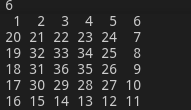

# Creating an array of spiral form using lists in_Python
Using lists create an array of spiral form in Python

### Reference to:
[1] Valentyn N Sichkar. Using lists create an array of spiral form in Python // GitHub platform [Electronic resource]. URL: https://github.com/sichkar-valentyn/Creating_an_array_of_spiral_form_using_lists_in_Python (date of access: XX.XX.XXXX)

## Description
How to create spiral-formed array using lists in Python.

## GUI in Python

## MIT License
## Copyright (c) 2017 Valentyn N Sichkar
## github.com/sichkar-valentyn
### Reference to:
[1] Valentyn N Sichkar. Using lists create an array of spiral form in Python // GitHub platform [Electronic resource]. URL: https://github.com/sichkar-valentyn/Creating_an_array_of_spiral_form_using_lists_in_Python (date of access: XX.XX.XXXX)
